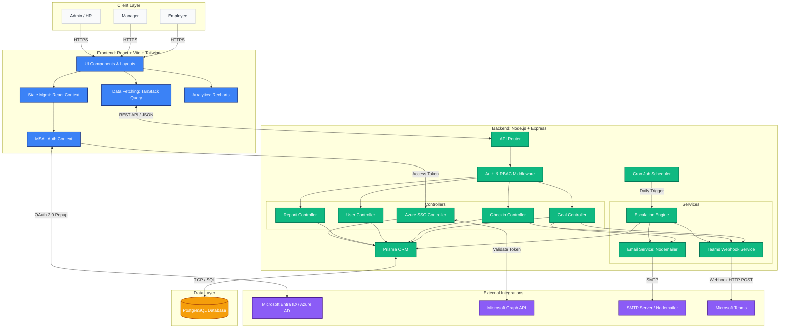

# AtomQuest Architecture

AtomQuest is a robust, enterprise-grade Goal Setting & Tracking Portal built using a modern full-stack web architecture. The system is designed for scalability, security, and seamless integration with existing enterprise ecosystems (like Microsoft Entra ID and Teams). 

Below is the comprehensive architecture diagram illustrating the flow of data, components, and external services.

## System Architecture Diagram

## Architectural Highlights

### 1. **Client Layer (React / Vite)**
- **Tailwind CSS & Shadcn UI:** For responsive, modern, and dark-mode compatible aesthetics.
- **Framer Motion:** Delivers fluid micro-animations and page transitions to ensure a premium user experience.
- **TanStack Query:** Manages asynchronous data fetching, caching, and background state synchronization efficiently without bloated global stores.

### 2. **Application Server (Node.js / Express)**
- **RESTful API:** Standardized JSON endpoints protected by robust `jwt`-based authentication and Role-Based Access Control (RBAC).
- **Service-Oriented Structure:** Business logic is decoupled into specific controllers and services (e.g., `emailService`, `teamsService`) allowing for easier testing and maintenance.
- **Intelligent Escalation Engine:** A `node-cron` scheduled job running within the server memory that proactively checks for missed deadlines and orchestrates notifications to Managers and Skip-level leaders.

### 3. **Data Layer (PostgreSQL / Prisma ORM)**
- **Prisma Client:** Provides type-safe database queries and automated schema migrations.
- **Relational Integrity:** Safely manages complex relationships, such as Goal inheritance, multi-quarter tracking data, and recursive User reports (Manager $\rightarrow$ Employee).

### 4. **Enterprise Integrations**
- **Microsoft Entra ID (SSO):** Implemented via `@azure/msal-react` (Client) and Microsoft Graph API (Server) for secure authentication and instant organizational sync.
- **Microsoft Teams:** Uses Adaptive Cards via Webhooks to push actionable rich-text notifications directly into enterprise workflows.
- **Email Notifications:** Uses `nodemailer` with compiled `handlebars` HTML templates for beautifully structured transactional emails.
